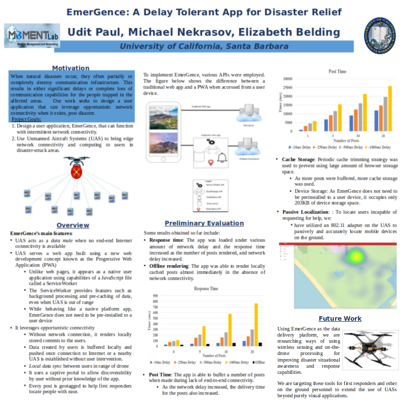

Udit Paul presented **[EmerGence: A Delay Tolerant Web Application for Disaster Relief](/papers/Nekrasov_2019_02_HotMobile-Poster-abstract.pdf)** on our joint work at ACM HotMobile in Santa Cruz. This work is the early stages of a project in delivering messages from a drone using emerging web standards.

  

The number and intensity of natural disasters have drastically increased in recent years and are anticipated to continue doing so. In addition to directly threatening human lives, disasters cripple communication and electric infrastructure, compounding the negative impact on humans, as observed for instance during Hurricane Maria in Puerto Rico [1]. This inevitably puts more strain on the remaining infrastructure resulting in failure of many people to effectively communicate. In this work, we have developed a progressive web application, EmerGence, designed to leverage opportunistic internet connectivity to relay messages from individuals trapped in disaster-hit areas. EmerGence works by bypassing the crippled/downed communication infrastructure to connect disaster victims with needed resources (both human and material) through a combination of a new web development concept called the Progressive Web App (PWA) and served by an Unmanned Aircraft System (UAS).

Unlike a traditional web page, PWAs look and feel like native applications using Javascript ServiceWorker that allows background processing and pre-caching of pages and data. Furthermore, unlike native applications, PWAs do not need prior installation, and work across devices and operating systems. We use the UAS as a delay tolerant edge server. This allows EmerGence to work on opportunistic connectivity setting it apart from other disaster relief applications [2-4].  EmerGence allows users to see posts made by other users as well as post their own content with or without network connectivity. In absence of network connection, the app renders locally stored contents to the users. Similarly, when users post during break in internet connection, the app buffers the posts locally and once connection is established, it pushes the contents without requiring further user action. Users are also notified in the event a new post is made. Each post is geo-tagged to locate people in need of help.  

EmerGence looks at how to provide delay tolerant edge connectivity to existing devices in a disaster-struck area.  To this end, it makes several novel contributions: (1) implements PWA for delay tolerant communication with a mobile edge server and (2) evaluates optimal transmission strategies for a PWA under poor network conditions.

We conducted preliminary tests to analyse performance of EmerGence. We introduced various level of delay in the network (to better emulate a congested network environment) to assess the time taken for the app to load and post a varying number of messages. In the absence of network connectivity, when loading up to 20 posts, results show that the app responds within 100ms as the contents are served from the local browser cache. However, with 1000ms delay in the network; it takes up to 800ms to load the same number of posts using the network. With the same amount of delay in the network, it is seen that the app takes about 25 seconds to post all 20 locally buffered messages.

In future work, we are evaluating novel transmission strategies, such as pre-generating static pages on drone to minimize connection time. We are also looking at expanding data delivery to include real time analysis performed on drone such as a natural language processing model to parse through the various user messages to categorize users into those who possess certain resources  
and those in need of such resources. We are also looking at tools for first responders such as automatic network coverage mapping.
