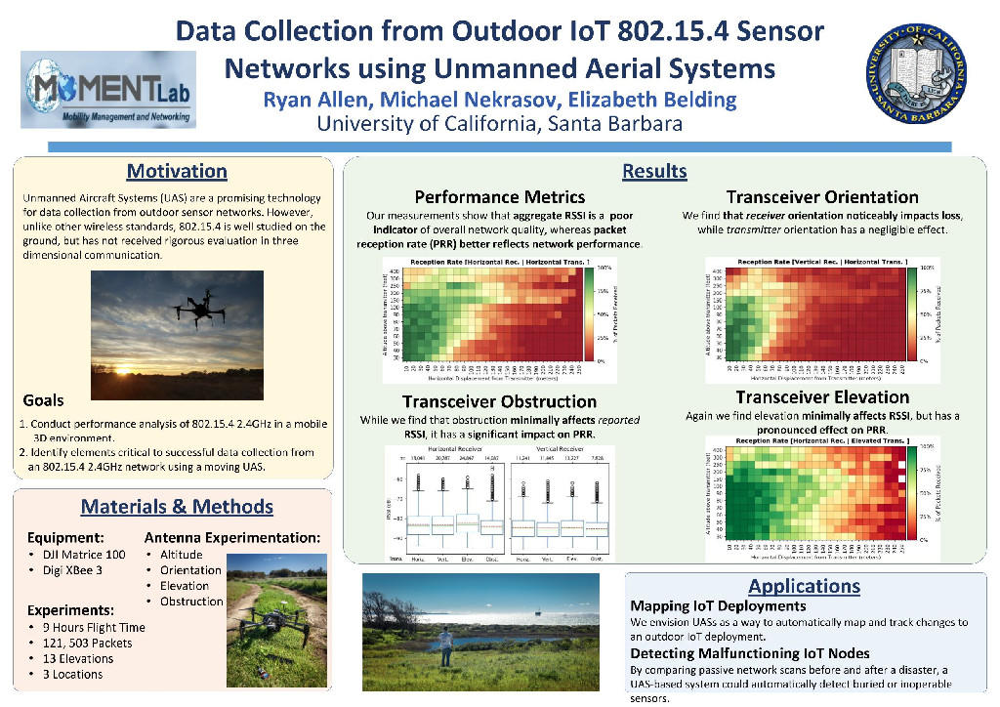

Ryan Allen presented our joint work on **[Data Collection from Outdoor IoT 802.15.4 Sensor Networks using Unmanned Aerial Systems](/papers/Nekrasov_2019_06_17_MobiSys_Poster-abstract.pdf)** at ACM MobiSys in Seoul, South Korea. This poster is an overview of our work in aerial wireless network research. Ryan is presenting our paper on 802.15.4 drone based data collection later in the week at DroNet 2019.
.

  

Unmanned Aircraft Systems (UAS) are a promising technology for data collection from outdoor sensor networks. Environmental and agricultural networks may not have existing internet backhauls for data delivery due to low population densities in rural areas, making UASs a potential data delivery alternative. 
UASs can be deployed as aerial network relay nodes or as data mules. In addition to mending network fragmentation, UAS applications include post-disaster data collection involving inoperative communication infrastructure, supplementing existing communication infrastructure for vehicular networks, and rural applications in environmental monitoring and precision agriculture. 

While the performance of on-the-ground 802.15.4 networks is well understood, communication in three dimensional space provides additional challenges. Compared to stationary or slow-moving ground-network nodes, UAVs are highly mobile, resulting in poor performance of protocols such as 802.11. Moreover, due to toroidal radiation patterns in consumer omni-directional antennas, antenna orientation can have a strong affect on signal quality in both 802.11 and 802.15.4.

We present our current work on the use of 2.4GHz 802.15.4 for data collection from a UAS. Unlike past research, we examine ground-air interaction using a physical aerial test-bed, from a highly agile UAS in three dimensional space. We look at factors that affect UAS-based data collection as well as applications for UAS-based IoT network management.  

