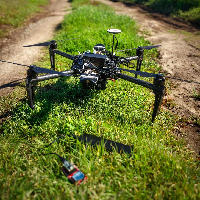

For the last 9 months, I have been working with [Ryan Allen](https://www.linkedin.com/in/ryan-allen-ba5560124/), a now just graduated Masters student. He was a pleasure to work with and extremely reliable. He is presenting our work: **[Performance Analysis of Aerial Data Collection from Outdoor IoT Sensor Networks using 2.4GHz 802.15.4](/papers/Nekrasov_2019_06_21_DroNet)** in Seoul, South Korea at *ACM DroNet*.

Unmanned Aircraft Systems (UAS), i.e. drones, have been commercially successful in both the consumer and industrial sectors in part due to the wide variety of applications they benefit. In environmental monitoring and precision agriculture, UASs can be utilized for data collection from rural IoT sensor networks. 

These networks frequently operate over some variant of the IEEE 802.15.4 standard, taking advantage of the standard's low power usage. Consumer 802.15.4 radios are widely available in compact form factors, making them ideal for application in environmental and agricultural sensor networks. 

Unlike other wireless standards, 802.15.4 is well studied on the ground but has not received rigorous evaluation in three dimensional aerial communication, which introduces new challenges, such as antenna radiation patterns and extreme ranges. 

This paper provides an initial look at the performance of 2.4GHz 802.15.4 for data collection from a UAS. We provide experimental performance measurements using an outdoor aerial testbed, examining how factors, such as antenna orientation, altitude, antenna placement, and obstruction affect signal strength and reception rate of packets. We find that these parameters play a significant role in reception rate, but have a much weaker impact on received signal strength. We conclude by discussing some takeaways on sensor network configuration for aerial data collection.

You can also read it from the [ACM Digital Library](https://dl.acm.org/citation.cfm?id=3329769).
