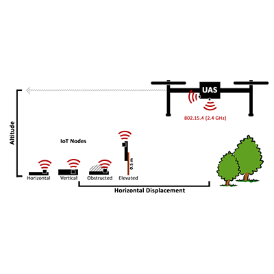

My work with [Ryan Allen](https://www.linkedin.com/in/ryan-allen-ba5560124/), on **[Optimizing 802.15. 4 Outdoor IoT Sensor Networks for Aerial Data Collection](/papers/Nekrasov_2019_08_09_Sensors.pdf)** has been published in the Sensors Special Issue on "UAV-Based Applications in the Internet of Things (IoT)". 

Rural IoT sensor networks, prevalent in environmental monitoring and precision agriculture, commonly operate over some variant of the IEEE 802.15.4 standard. Data collection from these networks is often challenging, as they may be deployed in remote regions where existing backhaul infrastructure is expensive or absent. With the commercial and industrial success of Unmanned Aircraft Systems (UAS), there is understandable interest in using UASs for delay tolerant data collection from 802.15.4 IoT sensor networks. 

In this study, we investigate how to optimize 802.15.4 networks for aerial data collection, which, unlike other wireless standards, has not received rigorous evaluation for three-dimensional aerial communication. We analyze experimental measurements from an outdoor aerial testbed, examining how factors, such as antenna orientation, altitude, antenna placement, and obstruction, affect signal strength and packet reception rate. 

In our analysis, we model and predict the quality of service for aerial data collection, based on these network configuration variables, and contrast that with the Received Signal Strength Indication (RSSI)—a commonly used signal strength metric. We find that network configuration plays a significant role in network quality, which RSSI, a mediator variable, struggles to account for in the presence of high packet loss. We conclude with a discussion of strategies for optimizing sensor network configuration for aerial data collection, in light of our results.

You can also read it Open Access from [MDPI: Sensors](https://www.mdpi.com/1424-8220/19/16/3479/htm).

