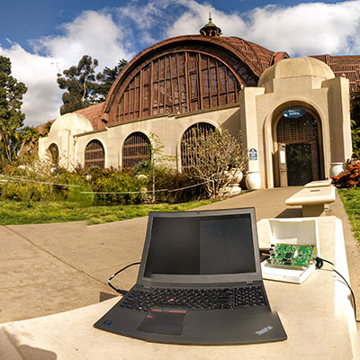

As you may have seen in previous posts, I have been working with [Vivek Adarash](https://www.linkedin.com/in/vivekadarsh) on LTE cellular congestion monitoring. Our paper titled  **[Packet-level Congestion Estimation in LTE Networks using Passive Measurements](/papers/Nekrasov_2019_10_21_IMC_Congestion_Paper.pdf)** was published and presented at the [Internet Measurement Conference](https://conferences.sigcomm.org/imc/2019/).  

Over 87% of US mobile wireless subscriptions are currently held by LTE-capable devices. However, prior work has demonstrated that connectivity may not equate to usable service. Even in well-provisioned urban networks, unusually high usage (such as during a public event or after a natural disaster) can lead to overload that makes the LTE service difficult, if not impossible to use, even if the user is solidly within the coverage area. A typical approach to  detect and quantify overload on LTE networks is to secure the cooperation of the network provider for access to internal metrics.  An alternative approach is to deploy  multiple mobile devices with active subscriptions to each mobile network operator (MNO). Both approaches are resource and time intensive. 

In this work, we propose a novel method to estimate overload in LTE networks using only passive measurements, and without requiring provider cooperation. We use this method to analyze packet-level traces for three commercial LTE service providers, T-Mobile, Verizon and AT\&T, from several locations during both typical levels of usage and during public events that yield large, dense crowds. This study presents the first look at overload estimation through the analysis of unencrypted broadcast messages.  We show that an upsurge in broadcast reject and cell barring messages can accurately detect an increase in network overload.
