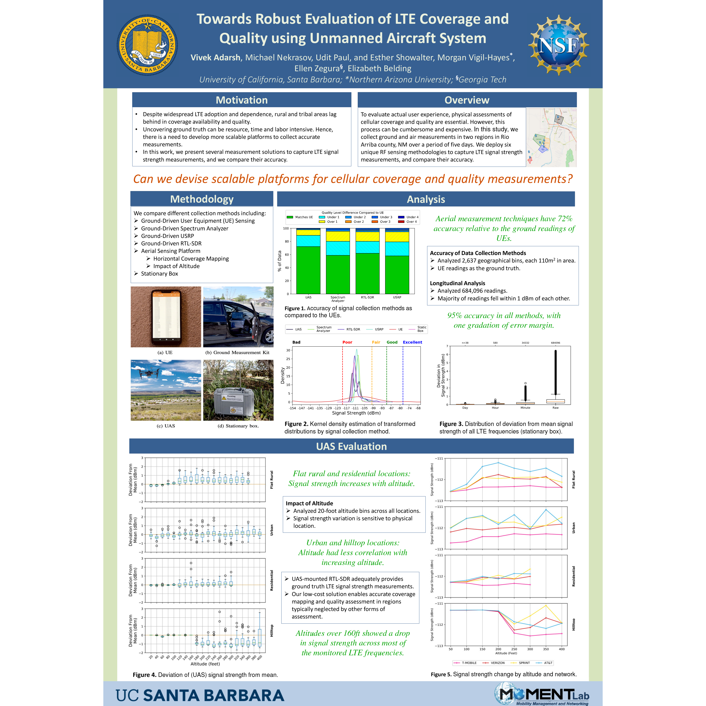

[Vivek Adarash](https://www.linkedin.com/in/vivekadarsh) presented some of our work on new tools **[Towards Robust Evaluation of LTE Coverage and Quality using Unmanned Aircraft System](/papers/Nekrasov_2019_10_21_IMC_Poster.pdf)** during a poster session at the [Internet Measurement Conference](https://conferences.sigcomm.org/imc/2019/) in Amsterdam.  

While LTE networks today serve billions of users, rural areas lag behind in coverage availability and quality. In the United States, the Federal Communications Commission (FCC), which regulates mobile broadband, reports increase in LTE availability. However, the most recent FCC Broadband Report was criticized for overstating coverage. These overstatements are due in part to optimistic propagation models, and to cellular provider misrepresentations of coverage. To accurately determine cellular coverage and usability, physical assessments are essential. However, measurement campaigns can be time and resource intensive; more scalable measurement strategies are urgently needed.

To audit provider-reported coverage claims, third parties can undertake independent measurement efforts. For instance, crowdsourced datasets provide signal quality reports over time for a wide range of devices, but these data cluster around major transportation arteries, omitting communities outside of these areas. Alternatively, wardriving campaigns involve physically navigating potentially difficult terrain in remote areas to record on-the-ground measurements. Unfortunately, this method scales poorly due to considerable time and labor requirements.

The availability of low cost, programmable, highly agile unmanned aerial vehicles has spurred interest in employing aerial RF sensing for cellular coverage mapping. Unmanned Aircraft Systems (UAS) enable coverage for large geographic areas, which may be costly, difficult, or impossible to cover on the ground. Extending UAS capabilities could further enable uses for scalable rural cellular coverage mapping as well as post-disaster recovery efforts. 

In this study, we collect and analyze ground and air measurements in Rio Arriba county, New Mexico over a period of five days. We assess the accuracy of a low-cost RTL-SDR for sensing LTE signal strength over a wide area through integration with an off-the-shelf UAS. We compare reading accuracy of the UAS with commonly used hardware for ground-based wardriving (i.e. a spectrum analyzer and a USRP). This is the first study that investigates the effect of altitude on signal strength measurements to align ground-level measures with aerial sensing. To compare the signal strength between user equipment (UEs) (i.e. smartphones, tablets, and hotspots) and UASs, we deploy four cellular devices on the ground, each collecting ``ground-truth'' measurements from different cellular networks, and compared these measurements over the same geographic area to those collected by the RTL-SDR on the UAS. 

Our findings reveal that the low-cost aerial measurement techniques have 72% accuracy relative to the ground readings of user equipment, and fall within one quality gradation 98% of the time. Further, we show that RTL-SDRs can be mounted on a UAS to more rapidly measure coverage across wider geographic regions. Together, our findings offer a detailed look at the efficacy of low-cost, public controlled, aerial coverage and quality sensing.
