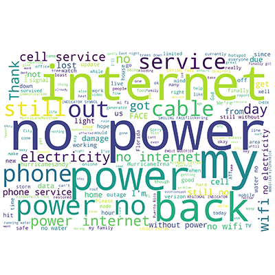

For the last half year I have been helping [Udit Paul](https://www.linkedin.com/in/uditapaul) on new information extraction techniques for social media analysis. Our paper (I am the third author on this work) titled  **[#Outage: Detecting Power and Communication Outages from Social Network](/papers/Nekrasov_2020_04_20_WWW_DetectingOutagesSocialNetwork.pdf)** was published and presented at the [The Web Conference](https://www2020.thewebconf.org/) in Taipei (virtually due to COVID19).  

Natural disasters are increasing worldwide at an alarming rate.  To aid relief operations during and post disaster, humanitarian organizations rely on various types of situational information such as missing, trapped or injured people and damaged infrastructure in an area. Crucial and timely identification of infrastructure and utility damage is critical to properly plan and execute search and rescue operations. However, in the wake of natural disasters, real time identification of this information becomes challenging. This research investigates the use of tweets posted on the Twitter social media platform to detect power and communication outages during natural disasters. 

We first curate a data set of *18,097* tweets based on domain-specific keywords obtained using Latent Dirichlet Allocation. We annotate the gathered data set to separate the tweets into different types of outage-related events: power outage, communication outage and both power-communication outage. We analyze the tweets to identify information such as popular words, length of words and hashtags as well as sentiments that are associated with tweets in these outage-related categories. Furthermore, we apply machine learning algorithms to classify these tweets into their respective categories. Our results show that simple classifiers such as the boosting algorithm are able to classify outage related tweets from unrelated tweets with close to 100% f1-score. Additionally, we observe that the transfer learning model, BERT, is able to classify different categories of outage-related tweets with close to 90% accuracy in less than 90 seconds of training and testing time, demonstrating that tweets can be mined in real-time to assist first responders during natural disasters.
