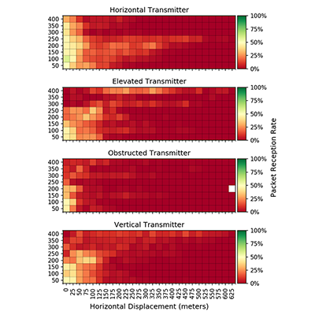

Our paper  titled  **[Impact of 802.15.4 Radio Antenna Orientation on UAS Aerial Data Collection](/papers/Nekrasov_2020_08_04_ICCCN_802_15_4_UAS.pdf)** was published and presented at the [The International Conference on Computer, Communication and Networks (ICCCN)](http://www.icccn.org/) In Hawaii (Virtually due to COVID19).  

Internet of Things (IoT) devices and sensors proliferate across a wide domain of applications, ranging from home automation to environmental monitoring. The IEEE 802.15.4 standard is one of the most common communication protocols for IoT devices, in part because standards designed for complex computing devices do not fit the power and network topology for many IoT applications. For example, the IEEE 802.11 (WiFi) standard consumes considerable power and is ill-suited for the periodic, low bandwidth communication  typical of IoT networks. In contrast, 802.15.4 is optimized for low power, low data rate node-to-node connectivity inside a local sensor network. However, remote sensor networks still require an Internet gateway for broader Internet access. In areas without Internet access, due to lack of infrastructure or due to infrastructure damaged in events such as natural disasters, alternate Internet access technologies are necessary.

One emerging approach to providing delay tolerant access to disconnected sensor networks utilizes Unmanned Aerial Systems (UASs). UASs already function in a number of rural applications, including automated ground surveying and precision agriculture. Most previous IEEE 802.15.4 research has focused on a flat, two dimensional network topography. However, interactivity between 802.15.4 and UASs occurs in a three dimensional space. This configuration poses unique challenges, such as a toroidal radiation and signal polarization, and generates new parameters for optimization, such as flight altitude and antenna orientation. 

Past literature suggests antenna orientation between transmitter and receiver significantly impacts network quality. 802.15.4 hardware comes in various types, such as coiled compact embedded antennae printed directly on the circuit board and external straight-wire antennae. In our previous analysis of UAS data collection from 802.15.4 ground-based devices, we discovered that embedded coiled antenna orientation of the transmitters and the receivers had little impact on signal strength. However, we theorized that external antenna modules may be more sensitive to orientation and therefore might display previously observed behavior, such as toroidal radiation. 

To our knowledge, this is the first paper to analyze the performance impact of antenna orientation in an outdoor rural aerial 802.15.4 network using external straight wire antennae. We study the effects of toroidal radiation and antenna polarization on signal strength. We compare external antenna configurations to the commonly used embedded coiled antenna modules.  We model our data using a Zero Inflated Negative Binomial (ZINB) model. For each hardware configuration and orientation, we identify the optimal altitude to fly an UAS in our testbed.  Our results show that the best choice of antenna configuration (including type and orientation) for an IoT network depends on the intended UAS collection flight plan. For example, in our study, we find that UAS flights with a horizontal displacement to transmitters less than 150 meters optimize when using vertically oriented transmitters with internal antennae and a UAS flight altitude of 150-250 feet. On the other hand, UAS flights with a horizontal displacement to transmitters exceeding 150 meters optimize when using vertical transmitters with external antennae and are not sensitive to flight altitude.
