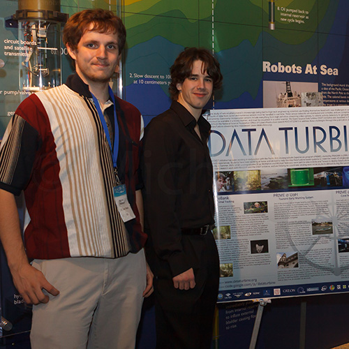
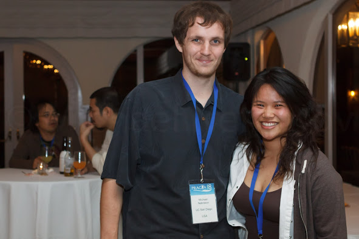

Poster on [monitoring coral spawning using underwater fluorescence camera system](/papers/Nekrasov_2010_03_PRAGMA_18.pdf) was accepted into the PRAGMA 18 workshop.  

Coral reefs are a diverse and dynamic environment, and
they continue to flourish in activity even after the sun
has set. Diving takes large amounts of time and can be
treacherous during night time. Because of these issues,
it is beneficial to setup long term underwater surveillance
systems to monitor the behavior of the reef even
during times the human eye can not. Data collected by sensors on the reef
can often give indicators that an event of interest is occurring and so can
be used to give an early warning to scientists that more direct observations
need to be conducted.

During the summer of 2009 I went to
the National Museum of Marine Biology and Aquarium in Taiwan as part of
UCSD’s PRIME program. The project was a joint collaboration between
CALIT2 and Scripps Institute of Oceanography (SIO) in San Diego, and the
Taiwanese National Center for High-performance Computing (NCHC) and
Museum of Marine Biology and Aquarium (NMMBA). The principle collaborators
were Dr. Tony Fountain, the PI for
the Open Source DataTurbine Initiative at
UCSD CALIT2, Dr. Dimitri Deheyn and his PHD
student Melissa Roth, researchers at the Marine
Biology Research Division at SIO , Dr. Fang-
Pang Lin , a researcher in information technology
at NCHC and coral biologist Dr. Tony Fan
from NMMBA.

The project used an excitation light and blocking filter to excite the
fluorescent protein in Seriatopora Hystrix to capture the
fluorescence on video. The fluorescent light allowed hard
to see coral features to be visible at night, and was also
used to study coral spawning events (which are normally
difficult to record since they occur at night and involve
coral larvae millimeters in diameter). The video was
streamed in real time using Data Turbine to an image recognition
program, developed by PRIME student Robert
Chen at UCSD, to identify and count the coral larvae and
store the results back into [DataTurbine](http://dataturbine.org) in real time.

