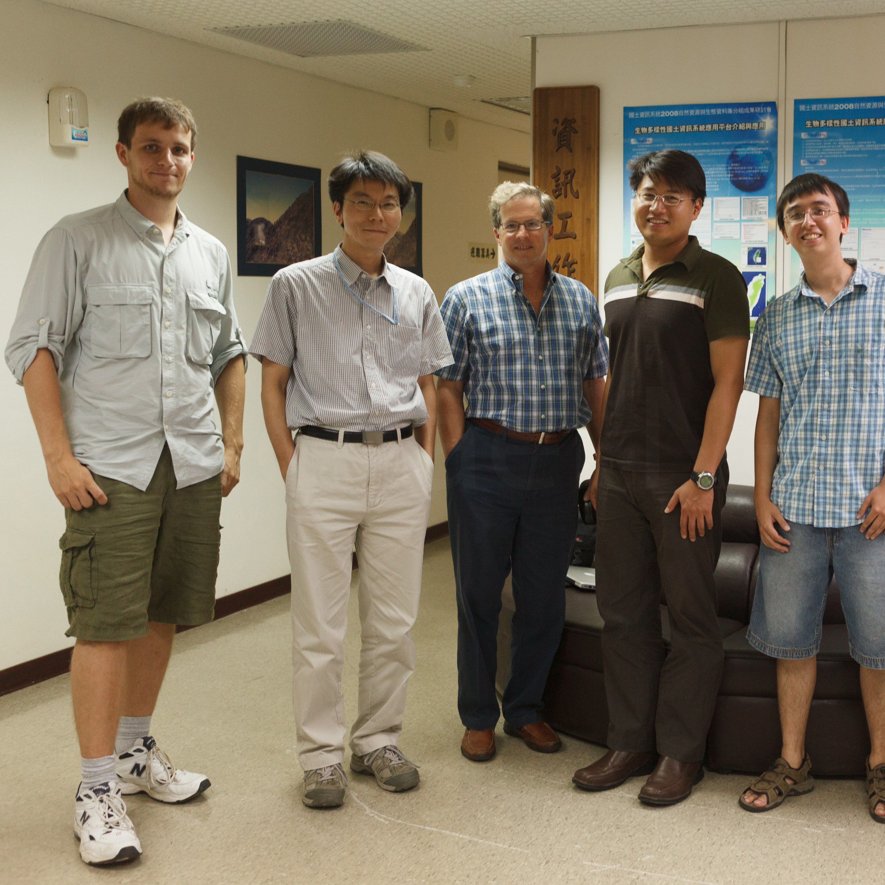

Mentored UCSD students for work with the Taiwan Forestry Research Institute (TFRI). They are working closely with TFRI scientist Dr. Chau Chin Lin and Dr. Lu to integrate real-time audio and video data into Open Source DataTurbine for a variety of applications including bee and wasp interaction and frog species identification. 

This work built off a previous project I did on automated counting of Honey bees.

The developed system is deployed at two TFRI field sites. Dr. Fountain is the UCSD mentor of these two students.

