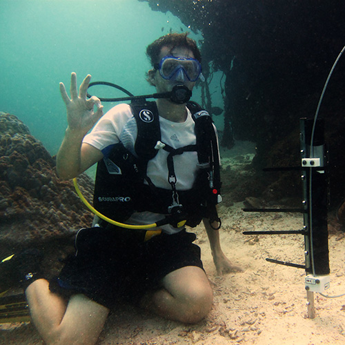

As part of the [Coral Reef Environmental Observatory Network (CREON)](http://www.coralreefeon.org) I worked on a team to deploy a new coral observatory at Racha Island in Thailand. The collaboration included members from the Center of Excellence of Ecoinformatics, Walailak University, the [Great Barrier Reef Ocean Observing System](http://imos.org.au/gbroos.html), and UCSD. 

As part of this project we deployed a SBE-37IM CTD that measures conductivity, temperature, and depth was deployed on the fringing reef at approximately 10 m water depth with 5 min sampling frequency. The deployment uses inductive coupling technology to send the data back to the station on the shore. A 350 m mourning cable runs from shore to the CTD, secured at 10 m intervals by 3 kg cinder bricks. The CTD is connected to the mooring cable via an inductive modem connection. This sensor deployment was interfaced to a shore-side DataTurbine server to manage the real-time data streams. This was streamed in parallel to high definition underwater cameras deployed on the reef. 

We will present their results at the next CREON workshop to be held in Brisbane Australia on 10 Dec 2010.
