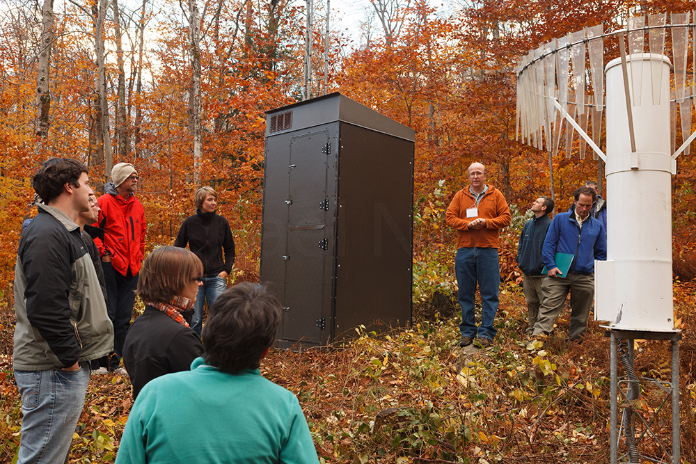

For the last several months I have been working with the the Hubbard Brook Experimental Forest in New Hampshire to integrate their data into DataTurbine. Combined with [Esper](http://www.espertech.com/esper/) a Java-based complex event and event stream processor, we have been looking at ways to automate the flagging of important biological events in data in real-time.

At SensorNIS I presented this work, and met with scientists from across the LTER network to discuss data challenges and technological approaches to environmental monitoring.

