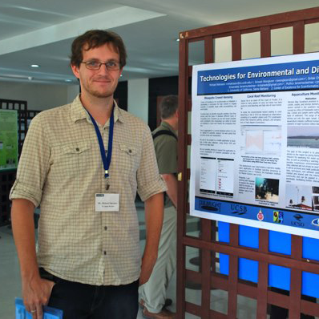

I attended the [PRAGMA 24 Workshop](http://www.pragma-grid.net/meetings/pragma-24-presentations/) in Bangkok where I presented my work on **[Technologies for Environmental and Disaster Monitoring](/papers/Nekrasov_2013-03_PRAGMA24.pdf)**

 

This presentation & poster outlined the ongoing work in developing cyber-infrastructure for multiple projects in environmental and disaster monitoring, here in Thailand. 

This work is funded by a Fulbright scholarship which spans the months of January to September of 2013. The work is a partnership between the Center of Excellence for Ecoinformatics at Walailak University and the University of California, Santa Barbara that brings computer scientists and biologists together for the study of Thailand’s coastal ecosystems. This work is part of an ongoing partnership initiated by the PRAGMA 18 workshop. The poster focuses on the development of three key pieces of infrastructure.

 
The first is a mosquito crowd-sensing mobile application that is part of an effort to integrate real-world science into local high school curriculum. The mobile application allows the identification and reporting of mosquito, which can serve as vectors for potentially serious diseases, such as malaria and dengue fever. The application also enables the reporting of natural and artificial water sources that allow breeding. 

The second involves extending the coral reef observatory at Racha Yai, Phuket to include a second remote site. The original deployment was a product of the PRAGMA 18 workshop that established collaboration between Australian Institute of Marine Science, COE at Walailak, and the University of California, San Diego. The observatory has been streaming data since 2010 and is now being extended (in partnership with the National Electronics and Computer Technology Center) to include a second site on the island, for the study of the coral reef there. We are developing new infrastructure to accommodate this expansion and relay real-time data from a site with no power or Wi-Fi.

 The third is an automated water quality and early warning flood detection system for aquaculture deployed Bandon Bay, in the Gulf of Thailand. The goal of this project is to provide a valuable service to the region by giving farmers and locals a resource for assessing the water quality in Bandon Bay, as well as providing a warning system against possibly treacherous environmental patterns. The data collected will not simply be used for forecasting, it will be archived and made publicly available. The data, techniques, and software used will be documented and shared with the international science community and can be applied in other research worldwide, facilitating further international collaboration.  

