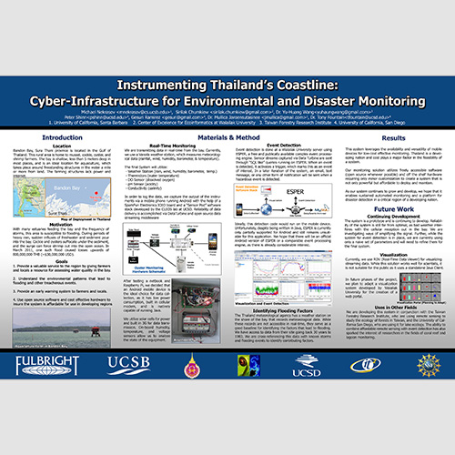

My poster titled **[Instrumenting Thailand’s Coastline: Mobile Devices for Environmental and Disaster Monitoring](/papers/Nekrasov_2013_05_Mobisys_Poster.pdf)** won best poster of *[Mobisys 2013](https://www.sigmobile.org/mobisys/2013/)*.

  

This poster outlines ongoing work using mobile devices for
communication and computation for environmental sensor
networks in Thailand. This work is funded by a Fulbright
scholarship spanning January to September 2013. The work is a
partnership between the Center of Excellence for Ecoinformatics
at Walailak University, the University of California Santa
Barbara, and the University of California San Diego. It brings
computer scientists and biologists together for the development of
technology aimed at studying Thailand’s coastal ecosystems.
Bandon Bay, Surathani province, is home to mussel, cockle,
oyster, and shrimp farmers. 

In March 2011, severe rainfall in the
southern region of Thailand caused an influx of freshwater and
sediment into the bay. Cockle and oysters were suffocated by a
thick layer of sediment. The surge of water forced shrimp out into
the open ocean. As a result, the aquaculture industry suffered
immensely, with losses upwards of eight hundred million Baht.
The aim of this project is to provide a valuable service to the
region by giving farmers and locals a resource for assessing the
water quality in Bandon Bay, as well as providing a warning
system against possibly treacherous environmental patterns.
The system utilizes a Galaxy Nexus Android phone for real-time
data collection and processing. 

The data is streamed to an Amazon EC2 server where it undergoes event-detection and
archived for later study by ecologists. The system is deployed in
the Gulf of Thailand, one mile off the coast. For power, the
system uses a 40W solar panel. The data is transmitted using the
phone’s built in cellular modem. The system utilizes a SparkFun
Electronics IOIO for interfacing to external sensors and power.
The phone currently interfaces with a Vaisala WXT 520
meteorological station, with plans to extend the sensor suite to
include water sensors for conductivity, dissolved oxygen, and pH.

The environmental conditions in the bay require a low power
device that is capable of wireless communication. While there are
industry devices capable of this, like the Campbell Scientific
sensor suites, they are prohibitively expensive for developing
nations and are heavily proprietary, impeding expansion and
development. In contrast, a mobile device running open source
software is a perfect candidate, as it is inherently capable of
cellular communication, has a backup battery for intermittent
power loss, and has the computing power necessary for data
ingestion and onboard processing from a multitude of
meteorological and aquatic sensors.

The system utilizes the [Open Source Data Turbine](http://dataturbine.org) streaming
middleware for real-time buffered data streaming and
visualization. It builds upon the SensorPod software stack
developed at UCSD for interfacing with environmental sensors.
For event detection, the system utilizes Esper for complex event
processing. The mobile device collects and streams the data,
which is captured by the cloud server and is run through a realtime
event detection engine. Both the original data and the
derived analysis are then made publicly accessible and mirrored
to universities in Thailand in real-time, using the DataTurbine
middleware. Interested parties can visualize both the data and the
derived analysis in real-time. In the event of connectivity
interruptions, the mobile device buffers the data and retransmits
when a connection is re-established.

Currently, the system is deployed in the bay, and we are in the
process of writing the event detection logic. Once the system is
determined to be stable, we will add water sensors necessary for
flood detection. We are investigating transitioning some of the
event detection logic onto the mobile device itself, but we are
hesitant to use the Android compatible version of ESPER, as it does
not have ongoing support. If this project proves successful, we are
considering mirroring the technology for use in coral observation
and detection of coral bleaching.

This work is made possible by my co-authors Sirilak Chumkiew & Peter Shinn,
as well as the support of Tony Fountain at UCSb and Krisanadej and Mullica Jaroensutasinee at Walailak University.
