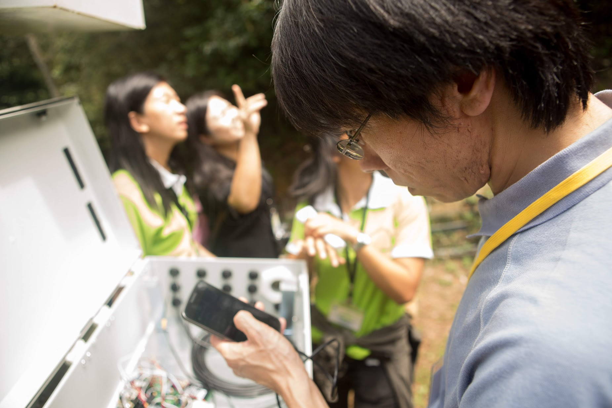
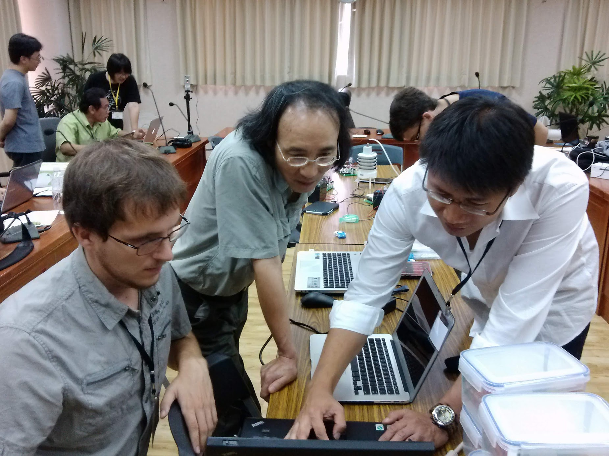

I helped instigate, plan, and execute the First OSDT Android SensorPod Workshop was held on 1-5 July 2013 at the Lienhuachih Research Center of Taiwan Forestry Research Institute (TFRI), Central Taiwan.

Twenty-four workshop participants, including scientists, engineers, and students from the United States, Taiwan, and Thailand, came together for 5 days to share experiences with wireless sensor networking applications and participate in a hands-on technical training course on the OSDT Android SensorPod.

Quoting from [DataTurbine.org](http://dataturbine.org):
"The OSDT Android SensorPod is a custom-designed mobile computing platform for assembling wireless sensor networks for environmental monitoring applications.  Funded by an award from the Gordon and Betty Moore Foundation to the University of California San Diego, the OSDT SensorPod represents a significant technological advance in the application of mobile and cloud computing technologies to near-real-time applications in environmental science, natural resources management, and disaster response and recovery.  It provides a modular architecture based on open standards and open-source software that allows system developers to align their projects with industry best practices and technology trends, while avoiding commercial vendor lock-in to expensive proprietary software and hardware systems.  The integration of mobile and cloud-computing infrastructure represents a disruptive technology in the field of environmental science, since basic assumptions about technology requirements are now open to revision.  It allows established facilities to plan graceful migrations as they adapt to inevitable technological change.  And the immediate effects may be more apparent in communities and countries where extant infrastructure is limited, as in many developing countries.  Wireless sensor networks and virtualization of data and network services is the future of environmental science infrastructure.  The OSDT Android SensorPod was designed with these considerations."

