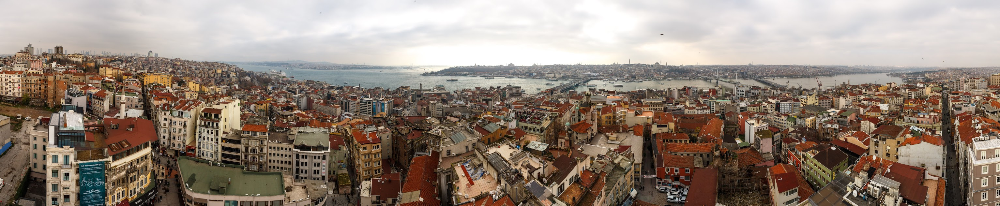

In December 2014, me, along with a team of other researchers from the University of California, Santa Barbara conducted a survey in Istanbul, Turkey as part of the FlowNet research project. This project aims to shed light on individuals’ current usage of information and communication technologies (ICTs) and free speech concerns; this information will support the development of a socially informed, censor-resistant technology that can be tested and deployed in several locations around the globe. For our work in turkey we conduccted surveys and in-person interviews.

The aim of this research was to better understand use of information and communication technology in Istanbul, Turkey and to gauge the opinions on issues of Internet freedom, censorship, and media trust. 

Based on our experience, the Istanbul residents sampled for this research are frequent and adept users of the Internet and social media. Most respondents are also well-versed in circumvention technology that allows them to access information or websites that are blocked by the Turkish government or other entities. 

Despite that, however, many respondents indicated in interviews that they would find the FlowNet software valuable due to the capacity to communicate more securely in groups with trusted others while still being able to verify others’ identities. For example, some interviewees suggested that knowledge of a social media user’s true identity had become increasingly important, as during the Gezi Park protests some anti-protest government employees posed as protestors on social media. While some activist interviewees suggested that they felt they could not use social media anonymously because of their social media following, many still felt that anonymity would be useful to others. Additionally, some interviewees noted that current available circumvention technologies, such as encryption or VPN, were very slow and frustrating to use.

Respondents actively seek and share information on a wide variety of topics using online social media such as Twitter and Facebook. Although many respondents believe that their Internet or social media access is at times blocked by the government, and a smaller number are afraid that their Internet or social media activity might be monitored, most do not appear to let concerns about privacy and surveillance online influence their use of social media and the Internet. 

Finally, perhaps because of the combination of low political trust among the sample and high government influence over mainstream domestic media at the time of this research, respondents find information from online social sources as well as other international media to be more trustworthy than traditional domestic media sources.

**UPDATE:**
You can read more about our results in [our paper](/papers/Nekrasov_2018_11_JISA.pdf) detailing our research in Mongolia, as well as Zambia and Turkey.

