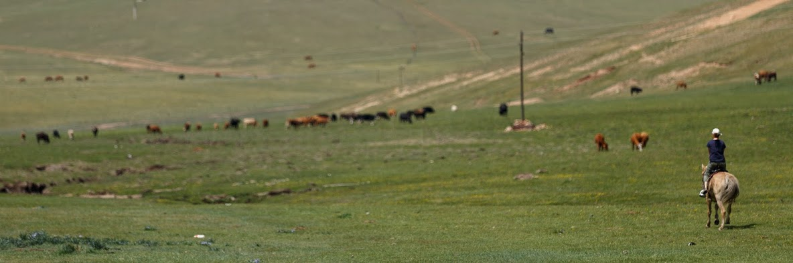
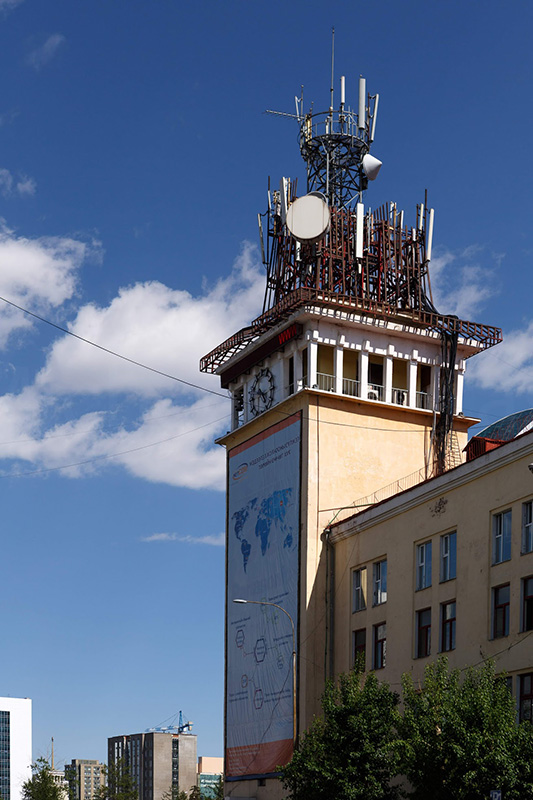
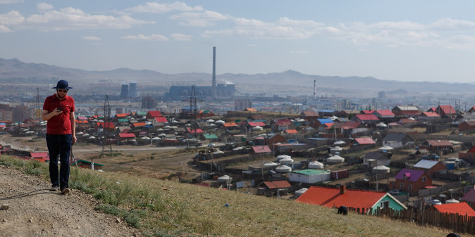
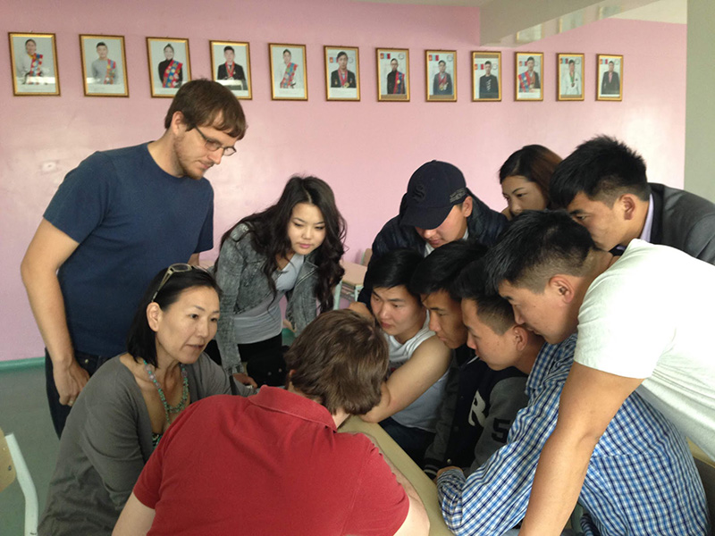
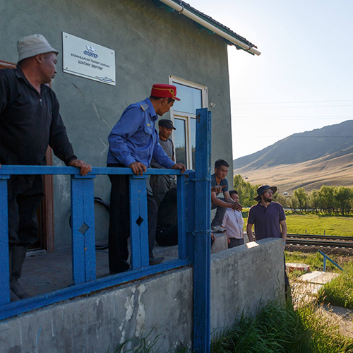
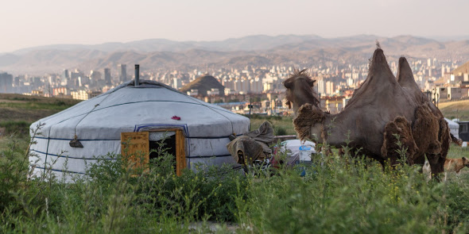

In June and July 2015, I along with a team of interdisciplinary researchers from the University of California, Santa Barbara conducted a survey in Ulaanbaatar, Mongolia as part of the FlowNet research project. This project aims to shed light on individuals’ current usage of information and communication technologies (ICTs) and free speech concerns; this information will support the development of a socially-informed, censor-resistant technology that can be tested and deployed in several locations around the globe. In addition to the survey, in-person interviews were also conducted. The aim of this research was to better understand use of information and communication technology in Ulaanbaatar, Mongolia and to gauge the opinions of members of our sample on issues of Internet freedom, censorship, and media trust. 

##Survey

In sum, the Ulaanbaatar residents sampled for this research are relatively frequent users of the Internet and social media, which can be contextualized by the economic growth the country has experienced over the past two decades. The survey results suggest that respondents actively seek and share information on a wide variety of topics using online social media – particularly Facebook.

However, despite Mongolia’s relative economic growth, respondents suggest that infrastructure issues (e.g., power outages or issues having to do with electricity, wireless, or Internet speed limitations) can still inhibit Internet use. The survey sample exhibited perceptions of generally moderate freedom of expression, and many modified their online social network use due to privacy concerns, most frequently by limiting who can see what they post online. The survey also suggested moderate political trust, but respondents generally exhibited relatively low interest in politics and news of a political nature. Extensive discussions with our Mongolian project partners suggest that many younger Mongolians (the majority of our sample) are apathetic about politics.

**UPDATE:**
You can read more about our results in [our paper](/papers/Nekrasov_2018_11_JISA.pdf) detailing our research in Mongolia, as well as Zambia and Turkey.

##Ger District

To understand how some of the poorer residents use the Internet we visited the Ger District of Ulaanbaatar. Houses there are built in an unplanned manner with self tapped power coming off power lines. There is no running water there, but there are water stations at the base of the hills that locals cart water from.

Surprisingly there is Internet connectivity via WiFi available using a pre-paid access card by [Кевико](http://kewiko.mn/). 12 hours of connectivity cost 2000 Tughrik (~$1 USD). However locals reported considerable challenges accessing the network. In our own atempted speed tests we found t he connection was so poor that speed tests repeatedly failed on the upload part of the test. Download speed results varied from 0.10Mb/s down to ~2Mb/s down Staying associated with the Wi-Fi access point was challenging and resulted in a frustrating user experience.

From what we could tell, the WiFi was provided by were 2.4GHz [Ubiquiti](https://www.ubnt.com/) APs broadcasting WI-Fi using three 120 degree sector antennas. The installed angle of the sector antennas is such that they will cover a large area, but coverage near the towers is poor. The sector antennas appear to be pointed mostly 'outward', only pointing 'downward' at a ~10 degree angle. Because of this, the access point beacons can be received even when phones are too far away to communicate with the towers, resulting in failed attempts to connect to the network. Based on the visible antennas on the towers, backhaul is provided by 5.8GHz point-to-point wireless links on each tower. 

##Security Training 

In addition to our research work, we conducted some security trainings with a verity of groups including at risk populations such as LGBTQ, groups aimed at stopping gender based violence, journalists and university students. 

We demonstrated what is sent via WiFi and how unsecured WiFi traffic can be intercepted. We also talked about relevant online security issues such as [how location on data sites such as Tinder and Grinder can be used to locate individuals](http://blog.includesecurity.com/2014/02/how-i-was-able-to-track-location-of-any.html).

Many of the groups we talked to started skeptical of the value of Internet security in their lives, but became interested and concerned when they understood what was possible. Even undergraduate studying information technology were relatively unaware what types of information is accessible and to whom when they use the Internet.

##Railroad - Site Visit

While conducting research we were given the opportunity to travel with the Mongolian Railroad personnel to conduct a site visit of their railway line. Interestingly, the Mongolian Railway also runs a fiber optic line along their track that connects China and Russia. Railhouses along the tracks serve as repeaters that boost the signal.

This presents an interesting opportunity as some of the most remote village I have ever been to have access to multi gigabit speeds. Our travels took us far from the city across the Mongolian plains. Half an hour into the city we pulled off the paved roads onto an unpaved road that snaked along the railway track. An hour later this road ended in the last connected town in the north.

We preceded along the line driving off-road across hills and streams for 4 more hours across stunning endless plains occupied only by the occasional Ger and accompanying herd of cattle or horses. There along the railway lines are winter towns. While many of the people of northern Mongolia are nomadic by trade, following herds during the summer. During winter, conditions become rough and people settle down into sturdy well stocked winter towns. 

As we were there during summer, these towns were mostly deserted. Older people and young kids were the primary inhabitants. As the railroad is one of the few large businesses in the area, these towns have a tight connection to the railroad as it is a primary employer and provider of infrastructure such as power.

