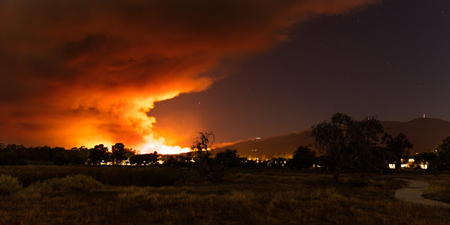

A fire north of us is lighting up the night sky. Scarily from our beach we can see the flames off in the distance.

As we watch the Sherpa fire from our backyard, my photos have made some impact and were picked up by [CNN](https://www.cnn.com/2016/06/17/us/california-fires/index.html)
who used my photo as a feature on their front page.

Unfortunately unless you have a contract with a news agency, these types of uses do not translate to any form of payment.
Guess I am at least honored that my work made the front page. I had friends in other state notice my work.

