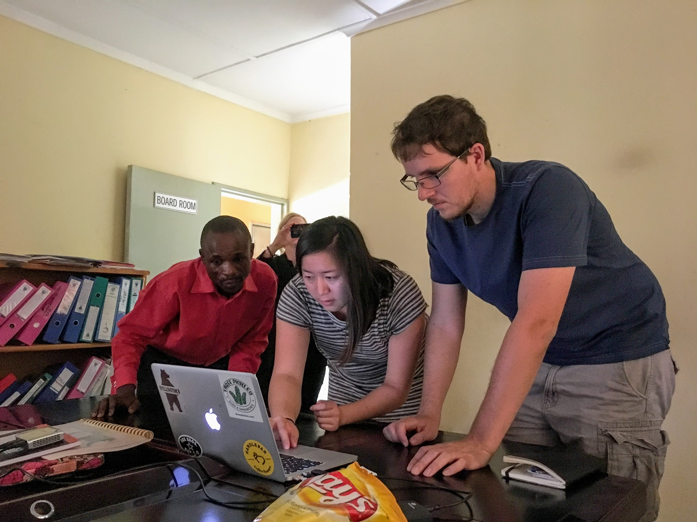
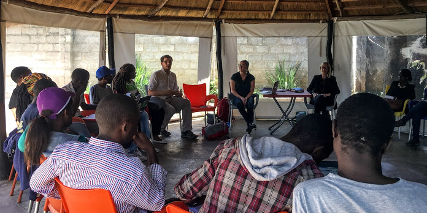

In June and July 2015, I along with a team of interdisciplinary researchers from the University of California, Santa Barbara conducted research in Lusaka, Zambia as part of the FlowNet research project. This project aims to shed light on individuals’ current usage of information and communication technologies (ICTs) and free speech concerns; this information will support the development of a socially-informed, censor-resistant technology that can be tested and deployed in several locations around the globe. We conducted, in-person interviews as well as small group discussions. The aim of this research was to better understand use of information and communication technology in Zambia and to demonstrate our prototype of [SecurePost](https://securepost.co) an Android application that we built, that provides group anonymity and verified authenticity for social media.

**UPDATE:**
You can read more about our results in [our paper](/papers/Nekrasov_2018_11_JISA.pdf) detailing our research in Mongolia, as well as Zambia and Turkey.

