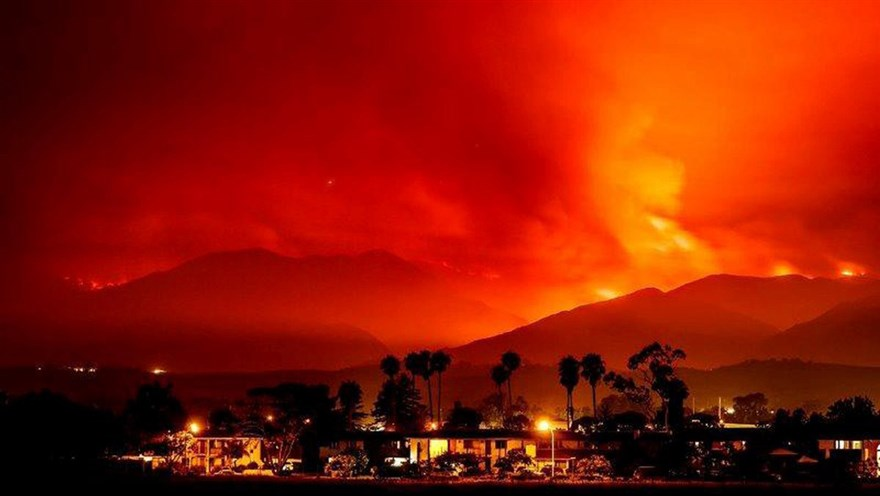

5 days later, the Whittier Fire still hangs like a specter above Goleta, CA.  So while we watch the fire from our bedroom window, something cool happened.

I tweeted out photos of the fire and as a result my photos of the fire got re-tweeted by Cal Fire, shared by Reuters and then picked up by many major news agencies.

* [Reuters](https://www.reuters.com/news/picture/wildfires-in-california-canyons-idUSRTX3ATX4)
* [NBC](https://www.nbcnews.com/slideshow/quick-spreading-california-wildfires-threaten-hundreds-homes-n781146)
* [Anchorage Daily News](https://www.adn.com/nation-world/2017/07/10/wildfires-spread-in-western-states-and-british-columbia/)
* [Mother Jones](https://www.motherjones.com/environment/2017/07/wildfires-are-about-to-go-from-bad-to-worse-in-california/)
* [Hindustan Times](https://www.hindustantimes.com/photos/world-news/photos-california-fires-leave-a-swath-of-destruction/photo-89xOmJEiNWYAs2OVsjAUSI.html)
* [Huffington Post](https://www.huffingtonpost.com/entry/california-wildifres-july-2017_us_5962497ae4b0615b9e9227a4)
* [NY Daily News](http://www.nydailynews.com/newswires/news/national/wildfire-california-canyons-spreads-overnight-article-1.3313878)
* [Chiemgau 24](https://www.chiemgau24.de/welt/news/waldbraende-verwuesten-teile-kaliforniens-zr-8475081.html)

Given the wide spread use, you would think someone would have asked for my consent.
Unfortunately what ended up happening is that CalFire re-tweeted my image and someone at Reuters thought
it came from CalFire itself so they never contacted me. In fact they initially didn't even credit me.
I had to reach out to them to correct this. Everyone else just used the Reuters image through presumably some kind
of image sharing agreement.

At least my work got views I guess.
