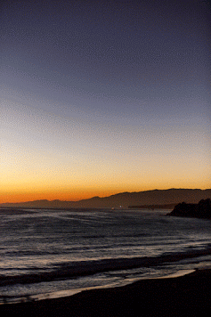
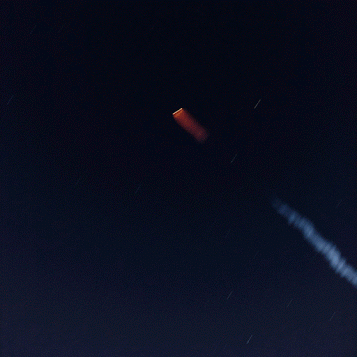
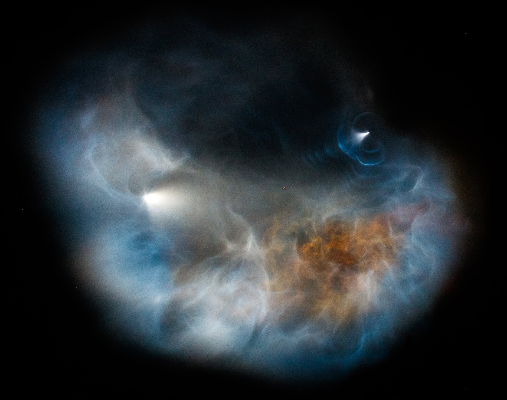
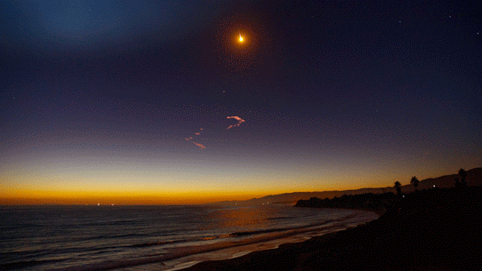
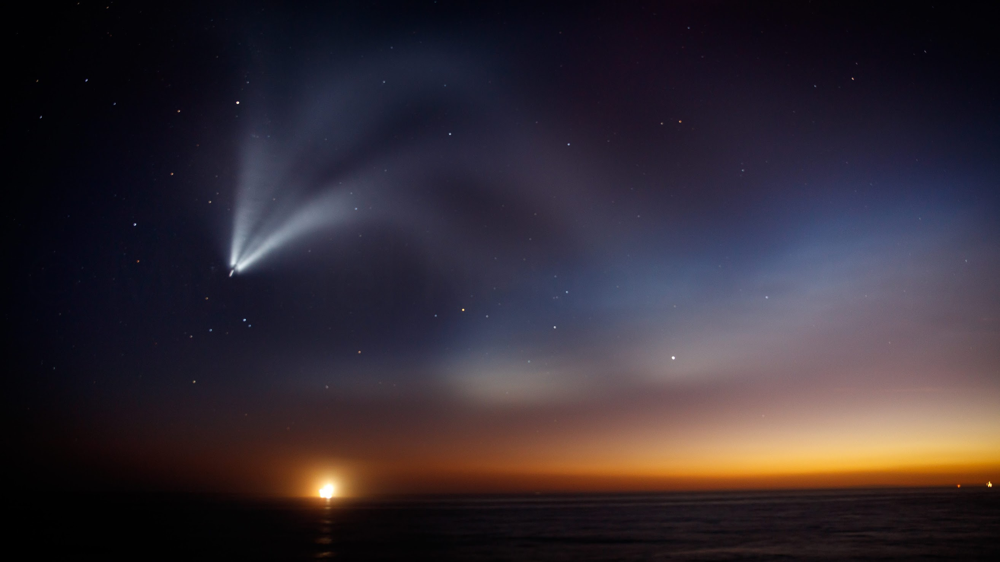

Tonight we got to watch a rare and fantastic sight of the Falcon 9 rocket by SpaceX from Vandenburg Air Force Base.
The rocket was carrying the SAOCOM1A satellite that is one of a pair that is capable of imaging the earth through clouds.

The liftoff was cool, but a sight that we have grown spoiled by from living in Goleta.
Rockets lift off from Vandenburg across the water from us and cast a strong orange glow on the waves.

Some time after liftoff, the first stage, that boosted the rocket up to a high elevation, separates from the rest of the
rocket. 

As the second stage continues on, the rocket releases a cloud of gas and ice crystals into the atmosphere.
As we were lucky to see this launch at sunset, the result was a fantastical nebula formed by the gas reflecting
the setting sun.

 For this launch, SpaceX landed the stage 1 rocket back at Vandenburg (for the first time). Because of this we
got to watch the stage 1 fire its thrusters to re orient itself. This created a cool ripple effect from the stage 1 as seen
bellow on the right hand side of the image.

Next the stage 1 began a burn to land back at Vandeburg, as the rest of the rocket continued on.

Finally the main engine on the rocket cutoff and the satellite release. The last part of the main burn is captured bellow.

The light at the bottom of the image is Platform Holly, our local oil rig.
