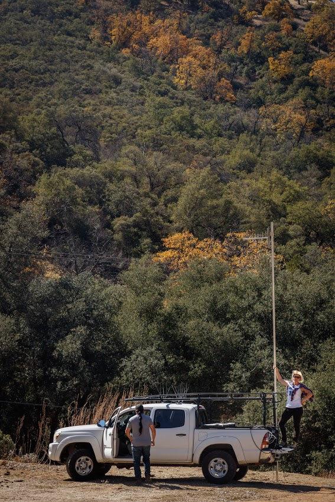
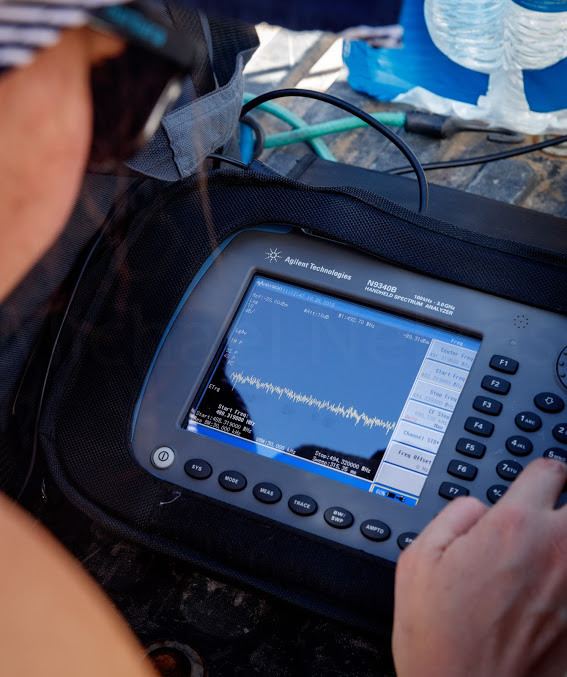
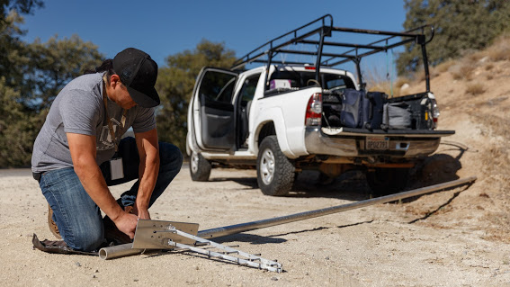
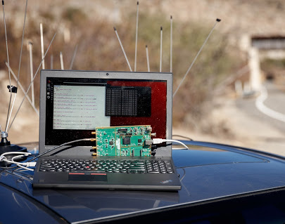

As part of my research I spent the weekend doing spectrum scans of [TV White Spaces](https://www.fcc.gov/general/white-space) and Cellular LTE bands with [Esther Showalter](https://moment.cs.ucsb.edu/people/esther-showalter). For this work we partnered with [TDV](http://tdvnet.com/) to visit the [Iiapay Nation of Santa Ysabel](http://www.iipaynation-nsn.com/) and the [Campo Kumeyaay Nation](http://www.campo-nsn.gov/) in order to understand LTE coverage and possibility of establishing new TVWS links.

One of the things I realized in grad school is that outside of publications that keep things brief and usually avoid talking about failures and issues, there are few explanations of what doing wireless research is like. In my last year of grad school I will try to make some posts about my work that hopefully a future visitor may find helpful.

We are devising a new system for automated network assessment from an aerial vehicle. The goal of this project is twofold (1) we want to verify reported coverage areas for various wireless protocols including LTE, TVWS, and WiFi and (2) we want to be able to be able to rapidly plan new network deployments by utilizing open wireless spectrum. In the rural context a new deployment may consist of a permanent wireless backhaul linking remote communities. While during or after a disaster it may take the form of short term deployments utilizing now vacant spectrum.

In order to determine the signal strength of particular frequencies we use hardware called [software defined radios](https://en.wikipedia.org/wiki/Software-defined_radio). In this case we used three separate devices simultaneously an Agilent Spectrum Analyzer, a [Ettus Research USRP](https://www.ettus.com/product), and a RTL-SDR. We followed up on [work by Ahmed Saeed et. al](https://www.cc.gatech.edu/~amsmti3/files/waldo_icdcs17.pdf) that looked at the efficacy of using a lower cost RTL-SDR for spectrum sensing as opposed to the expensive and bulky spectrum analyzer. As we would like to mount our system on a multi-copter, we would like to use the cheapest lightest device, so we performed our own three device comparison in the context of a rural native american reservation.
 
 From there we scan through a list of carrier frequencies recording the *dBm* (decibel-milliwatts). We pair the laptop with a GPS and tag each capture with the time and GPS cordinates we recorded them at. This gives us a good indicator if the channel is occupied, or at least the relative level of noise on that frequency.

While the scanning itself is a simple matter of driving around, finding the right frequencies is a more difficult matter. The TVWS bands are [well defined](https://en.wikipedia.org/wiki/North_American_television_frequencies) with the pilot frequency at .31 MHz from the lower edge. On the other hand LTE frequencies can occur anywhere on the many LTE bands at an EARFCN offset specified by the carrier. For bands commonly used in the USA, this means nearly 4,000 frequencies to capture, most of which are noise.

To narrow the search in parallel we run a script to identify the Primary Synchronization Signal (PSS) of transmitting stations. We append those frequencies to our spectrum scan. 

In addition to spectrum scanning we look at link quality over these wireless channels by running both passive and active analysis of the performance of their respective protocols. On this trip this was a big hassle as our TVWS transceiver had difficulty connecting to the existing network, even after days of debugging and hours on the phone with the manufacturer.

Now comes the hard part of analyzing the data and using our experience to inform system design.

