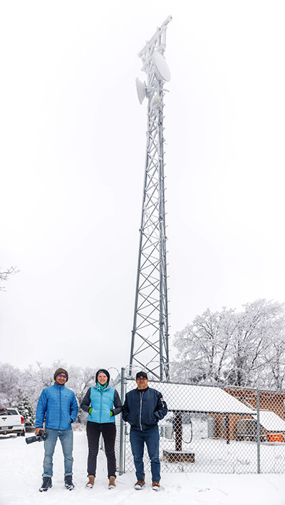

Our lab once again visit the [Iiapay Nation of Santa Ysabel](http://www.iipaynation-nsn.com/) as part of project to understand spectrum availability for [TV White Spaces](https://www.fcc.gov/general/white-space) and Cellular LTE. We partnered with [TDV](http://tdvnet.com/) for this work visited one of their repeater towers above the reservation. I was joined on this trip by 
[Esther Showalter](https://moment.cs.ucsb.edu/people/esther-showalter) and [Vivek Adarsh](https://moment.cs.ucsb.edu/people/vivek-adarsh). 

We had been planning and rescheduling this trip for months due to the winter rain and wind storms damaging local roads and infrastructure. Even still, on the week we were finally able to go it snowed the night of our arrival, with 4 inches of snow at higher elevations. The snow fall also caused a service outage to some TDV customers in the area due to the prolonged period of cloud cover and snow covering the solar arrays.

The original plan was for me to work in the area of the TDV relay tower, while they serviced the tower and installed new gear including an additional solar array and backup generator. As the road was [barely passable](https://photos.app.goo.gl/r5PxVzb7CBK6UVkFA) and the cold so intense that we instead cleaned the snow off the solar panels, and went to lower elevations to work. They will return later to upgrade the tower when conditions improve.

Our project was separated into three parts. Esther focused on TVWS active measurements in the reservation valley. She sent traffic across a TVWS link and compared that to the signal quality. The goal is to build a practical metric of TVWS signal to link performance for use in future deployments.  Vivek did a similar evaluation of LTE, evaluating the propagation of LTE signal compared to active traffic measurements.   

In the meantime I was working on spectrum sensing from a UAS. I took up my [DJI M100](https://www.dji.com/matrice100) equipped with a SDR (software defined radio) to scan TVWS and LTE channels. The goal was to create a heatmap of available and occupied spectrum and evaluate how altitude impacts received signal strength. 

For TVWS in particular, the FCC enforces non interference rules on conservative propagation models that seek to minimize interference. In reality local obstructions such as mountains, hills, and plant life may restrict interference. In our test we flew at 150ft and 300ft (in addition to the 0ft altitude Esther was collecting on the ground). We wanted to understand what spectrum was available for transmission over the reservation, what impact if any altitude had in real reception, and how this compared to FCC reports.

In the future my drone work could allow network planners in rural areas (such as TDV), or areas recovering from a natural disaster plan a LTE or TVWS deployment using empirical data collected from an aerial platform.
