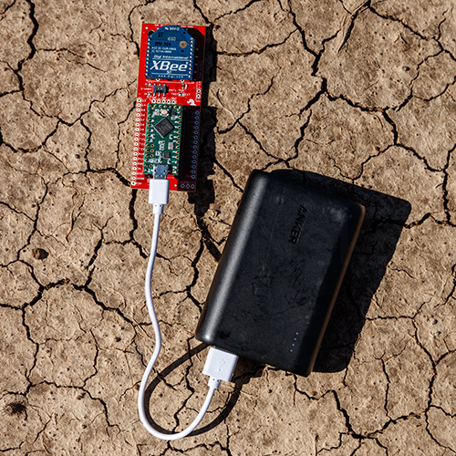

I am working with masters student [Ryan Allen](https://www.linkedin.com/in/ryan-allen-ba5560124/) on a project to sense wireless transmissions from small [802.15.4](https://en.wikipedia.org/wiki/IEEE_802.15.4) transmitters. These small modules, as shown in the image, are typically used to transmit data and home devices for sensing applications (room occupancy, soil moisture, etc..).

Our project passively captures RSSI readings from these devices. We are looking to answer a few research questions:
* At what altitude and horizontal displacement can a drone capture these transmissions?
* Is it possible to locate the GPS coordinates of these devices using a single drone?
* Given a baseline, can we detect abnormalities in the network from a drone?

So far we have run a few tests and found that while the [Digi Xbee S1 - PCB](https://www.digi.com/pdf/ds_xbeemultipointmodules.pdf) promises an outdoor range of 100m, even in nearly ideal line of sight condition the actual operable distance is considerably lower (in the 10-15m range). This range is unlikely to be useful for a real IoT deployment due to the required 

We therefore are switching to the newer [Digi Xbee S3 - PCB](https://www.digi.com/products/embedded-systems/rf-modules/2-4-ghz-modules/xbee3-zigbee-3#specifications) version which should be more realistic with a 1200m outdoor range. 

More sitting in the field, flying drones for us.
