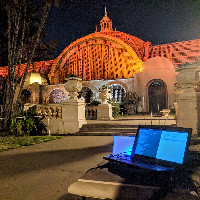

Over the past year I have been working with [Vivek Adarsh](https://moment.cs.ucsb.edu/people/vivek-adarsh) on passively detecting congestion on LTE cellular networks. You can read a short explanation of what that means in a [previous post](/posts/2019-02-21-lte-congestion/).

This time we went to 
San Diego for the Saint Patrick's day festivities. This turned out fruitful as the parade, festival, and concert were all held on city streets where the cellular network was not sufficiently provisioned for the number of attendees. As a result we were able to capture a degradation in performance.

We submitted a paper on this, and I will post the product of our work if accepted. 
