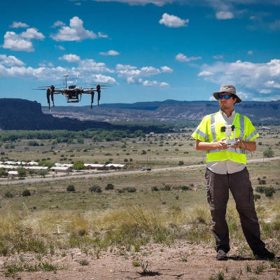

From May 25th to June 3rd our team (four Ph.D students from the University of California Santa Barbara, led by professor [Morgan Vigil-Hayes](http://www.vigilant-m.com/) from Northern Arizona University, traveled to Santa Fe, New Mexico, to conduct quantitative measurements of cellular and TV White Space (TVWS) in tribal and non tribal rural regions. The team partnered with local officials from Santa Clara Pueblo, Ohkay Owingeh, and  Rio Arriba County. The team gathered data on the coverage, quality of service, and quality of experience of the major cellular providers in the area (T-Mobile, ATT, Sprint, Verizon) and explored the possibility of extending internet connectivity using TVWS by looking at current channel occupancy. 

In addition to the research work, our team led outreach efforts at the Northern New Mexico Community College, and the Santa Clara Pueblo Library (where we taught local kid and adults basic principle of internet performance measurements as well as LTE and TVWS basics. 
