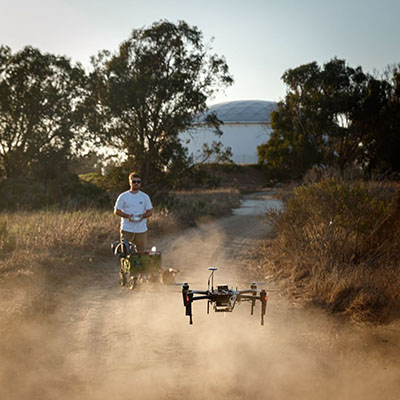

For the last 3 months I have been working with [Maxton Ginier](https://www.linkedin.com/in/maxton-ginier/), an undergraduate student working with our lab, to continue the work I started with [Ryan Allen](https://www.linkedin.com/in/ryan-allen-ba5560124/) on 802.15.4 aerial network assessment. Check out our [paper](https://michaelnekrasov.com/papers/2019-08-09-paper-sensors/) on the subject.

In our past work we looked at using Unmanned Aircraft Systems for aerial data collection from outdoor, rural, IoT sensor networks. While there has been a plethora of literature suggesting that aerial collection is feasible method of delay tolerant data collection, when reading the literature we discovered that there are very few studies examining what an optimal real-world network would need to look like for successful collection. 

In our initial work we performed physical experiments using [Digi Xbee3](https://www.digi.com/products/embedded-systems/digi-xbee/rf-modules/2-4-ghz-modules/xbee3-zigbee-3) 802.15.4 radio modules. We looked at impact of obstruction, elevation, altitude, and displacement on packet delivery in an experimental outdoor 802.15.4 network communicating with a UAS.

My work with Max builds on this prior research to examine how antenna orientation impacts packet loss. We plan to publish this work at the start of 2020.
