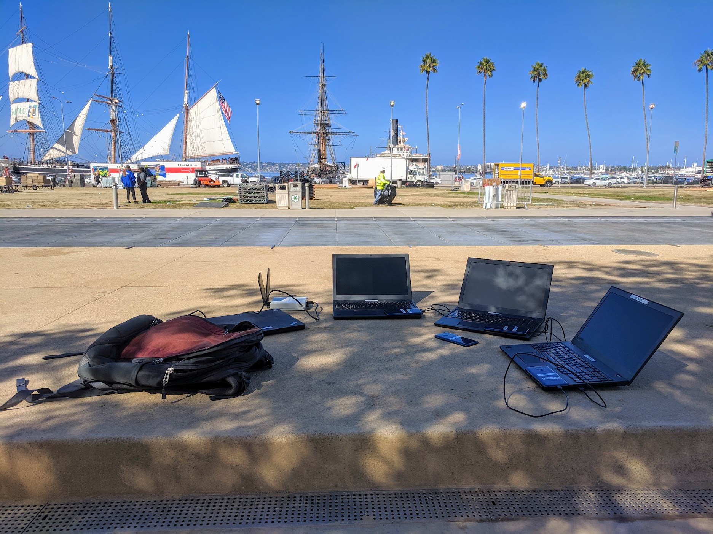

As I have mentioned in a couple  [previous posts](/posts/2019-03-16-sd-congestion/) and  [this one](/posts/2019-02-21-lte-congestion/), over the past year and a half I have been working with [Vivek Adarsh](https://www.linkedin.com/in/vivekadarsh) on passively detecting congestion on LTE cellular networks.  Our initial work has been published and presented at the [Internet Measurement Conference](/papers/2019-10-21-paper-imc/) last October. We are continuing to build on this idea and incorporate other cellular metrics such as: signal quality, quality of service (throughput, jitter, latency), quality of experience (page load time, video streaming, video calling) into our congestion work.

This time we went to San Diego to collect data at a series of events. Among the event we went to the farmer's market in Little Italy, the Adams Avenue street festival, and the [CRSSD](https://www.crssdfest.com/) music festival in waterfront park. As with other work it is more fun then it sounds, as instead of enjoying these venues we spent our time sitting on the sidelines collecting measurements. To compare times of cellular congestion to normal operation, we had to return to each venue in off peak hours to gather baseline measurements.

We are currently analyzing the terrabytes of data we collected and expect to publish in the first half of 2020. 
