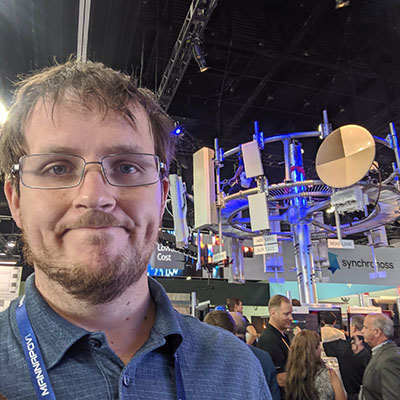

For the last few months we have been putting together a new project for 5G rural-centric networking. We will be submitting the proposal to [NSF](https://www.nsf.gov/) in December. To supplement our academic knowledge with industry experience, [Udit Paul](https://www.linkedin.com/in/uditapaul) and I went to the [Mobile World Congress](https://www.mwclosangeles.com/) in Los angeles. There we went to some awesome talks and got to see really cool next generation cellular tech.

A neat byproduct of this, was that we made a couple good contacts. The most fruitful of which was with [WeFi](https://www.wefi.com/) a mobile analytics company that we hope to partner with to develop new tools for cellular network assessment.

A difficult part in all this, is knowing that the partnerships we make and proposals we write won't be executed by me. I already have spent too long in graduate school, and while I can't keep up with all the cool things that I want to do, my graduate life is coming to a close. I plan to graduate March, 2020.
