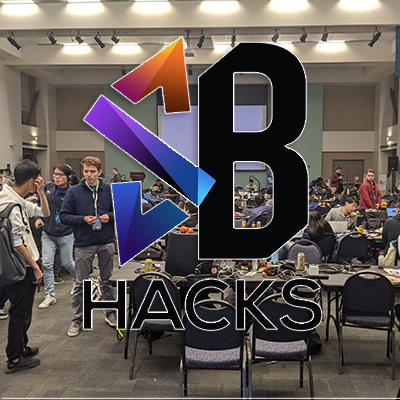

From TAing a Computer Networks course last quarter, I was asked to judge at [SB Hacks](https://www.sbhacks.com/), our regional hackathon competition held at UCSB.
Teams from local schools such as UCLA, UCR, USC, UCSB and SBCC were given 36 hours to come up with and execute inovative projects. Most were web based, some used physical sensors (like a fan based alarm clock, or wildfire CO2 sensors).

I had a lot of fun judging, and learning about the cool projects. I am amazed that people can slap some of these together in only 36 hours!
