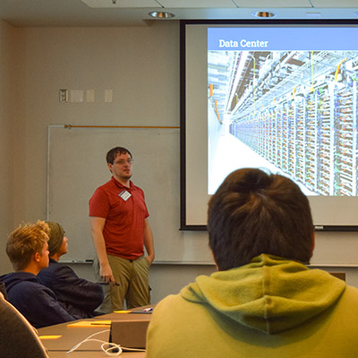

This quarter Sherri Conklin and I are teaching as part of a five week high school enrichment program as part of the [School for Scientific Thought (SST)](https://sst-csep.cnsi.ucsb.edu/).

Our class is titled *Computer Ethics: Reshaping Society Through Technology*. Computers make our lives easier, and, as a result, we include them in every aspect of our lives. We use them to communicate with our friends and families, to seek out entertainment, to find jobs, and for many other reasons. Because we involve computers in every aspect of our lives, we also share a great deal of information with the companies that build technology. What we share and how this highly tailored personal information is used is a topic of continuous concern and debate. 

In this class we explore what these algorithms “know” about us and how they gather data. This class provides an overview of active areas of computer science including: Big Data, Machine Learning, Networking, Security, and Human Computer Interaction. Over 5 classes, we look at how technology and society interact. The class provides the skills for understanding how the technologies work as well as philosophical skills for critically engaging with these technologies.
