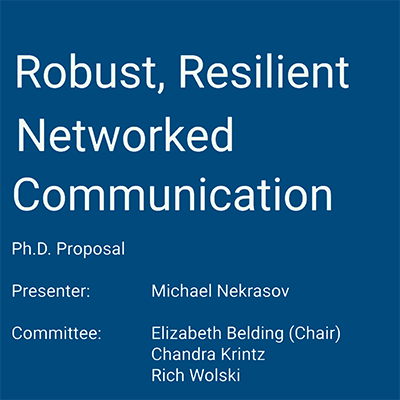

I have successfully defended my dissertation titled "*Robust, Resilient Networked Communication in Challenged Environments*" and attained a PhD in Computer Science from the University of California, Santa Barbara.

In challenged environments, digital communication infrastructure may be difficult or even impossible to access. This is especially true in rural and developing regions, as well as in any region during a time of political or environmental crisis. We advance the state of the art in wireless networking and security to design networks and applications that rapidly assess changing networking conditions to restore communication and provide local situational awareness.  

This dissertation examines new systems for responding to current and emerging needs for wireless networks. This work looks across the wireless ecosystem of widely deployed standards. We develop new tools to improve network assessment and to provide robust and reliable network communication. By incorporating new technological breakthroughs, such as the wide commercial success of Unmanned Aircraft Systems (UASs), we introduce novel methods and systems for existing wireless standards for these challenged networks. 

We assess how existing technologies and standards function in difficult environments: lacking end-end Internet connectivity, experiencing overload or other resource constraints, and operating in three dimensional space. Through this lens, we demonstrate how to optimize networks to serve marginalized communities outside of first world urban cities and make our networks resilient to natural and political crisis that threaten communication.

The defense itself was very unusual due to COVID-19. I did my defense online via Zoom, with my committee and audience members remotely calling in. 
