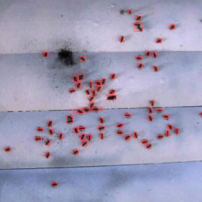

While working at UC San Diego, I partnered with the Taiwan Forestry Research Institute on automated bee detection. This work extended capacity of camera imagery for applications in honey bee population monitoring. We applied blob-detection using OpeCV to develop this package. 

We then tested the tool by using different bee presence number images
collected from Shanping wireless sensor network of TFRI. We compared the time
consumed between the automatic process and manual process. This work resulted in a published paper, exchange of students, and additional projects.
