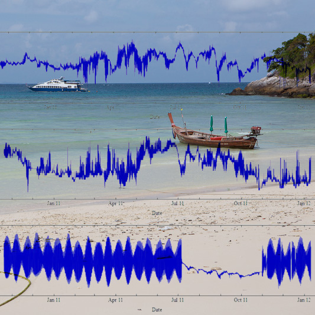

Environmental observation stations are systems which allow researchers to observe rare events and to document long-term changes in ecological systems. Here we describe a system used for acquiring and sharing numerical data and imagery with ecological researchers that is deployed at the Racha Island, Phuket, Thailand. This is a new observatory that aims to provide publicly accessible scientific data for researching the environmental changes of coral reefs.

This project is part of the Coral Reef Environmental Observation Network (CREON), a loose group of independent institutions made up of scientists and engineers whose goal is to develop tools for coral reef study. Building on CREON, this project is a collaboration between a diverse team of ecologists,
computer scientists, and engineers from the [California Institute of Telecommunications and Information
Technology at the University of California San Diego (CALIT2)](http://www.calit2.net/)), [the Australia Institute of Marine Science (AIMS)](http://www.aims.gov.au) and the [Center of Excellence of Ecoinformatics, NECTEC-Walailak University](https://www.wu.ac.th/en).

This deployment builds on the experiences of CREON members in establishing coral reef observatories that
can easily share and interchange data from multiple sites around the Pacific Rim. It is envisioned to be a living laboratory for long-term studies of marine ecology and a testbed for evolving technologies for environmental and biological sensing, communications, and analysis. 
