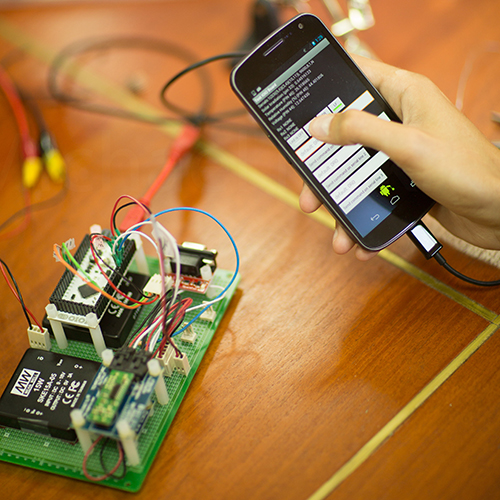

This work is funded by a Fulbright scholarship which spans the months of January to September of 2013. The work is a partnership between the Center of Excellence for Ecoinformatics at Walailak University and the University of California, Santa Barbara that brings computer scientists and biologists together for the study of Thailand’s coastal ecosystems. This work is part of an ongoing partnership initiated by the PRAGMA 18 workshop. 

Our work builds on open source technologies and standards to provide a system for real-time event detection in Bandon Bay, Thailand. Our system leverages the availability and versatility of mobile devices for effective low-cost monitoring in a region that is devoid of power and is prone to frequent cellular disruptions.

We are developing an automated water quality and early warning flood detection system for aquaculture deployed Bandon Bay, in the Gulf of Thailand. The goal of this project is to provide a valuable service to the region by giving farmers and locals a resource for assessing the water quality in Bandon Bay, as well as providing a warning system against possibly treacherous environmental patterns. The data collected will not simply be used for forecasting, it will be archived and made publicly available. The data, techniques, and software used will be documented and shared with the international science community and can be applied in other research worldwide, facilitating further international collaboration.  

