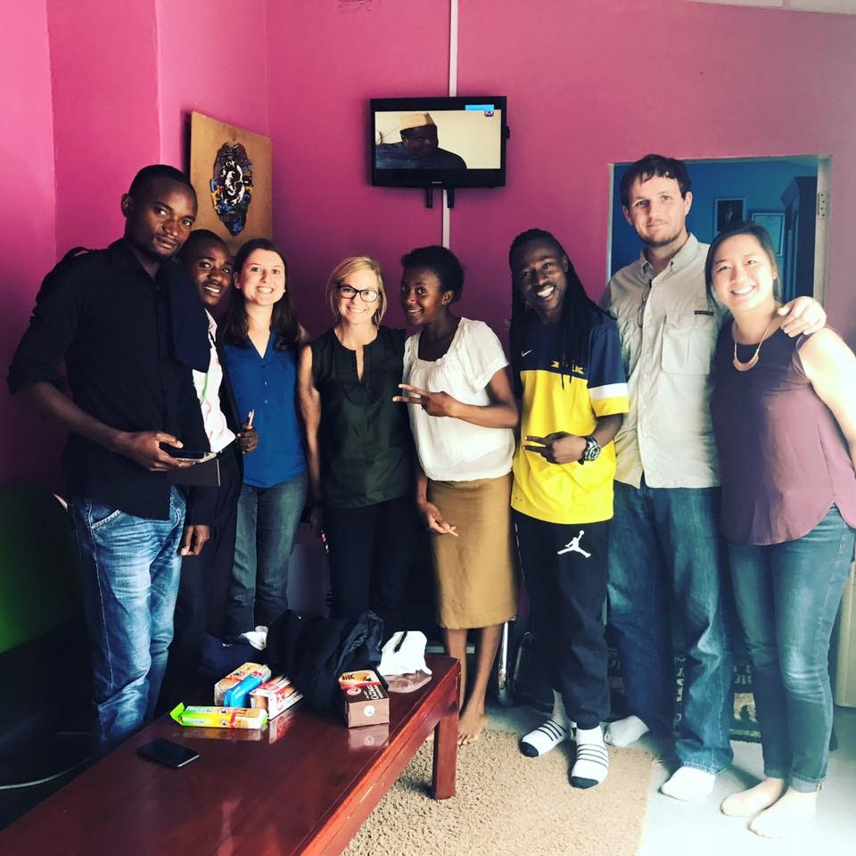

Online social networks are major hubs of communications that are used to share information by societies worldwide. However, the ability to freely communicate on these platforms is increasingly restricted in countries across the globe and existing technological solutions do not fully address the needs of affected communities. 

In this work we explore the design process of SecurePost, a novel tool that allows verified group anonymity to those communicating publicly on online social networks.  We present survey-based research and ethnographic interviews of communities vulnerable to censorship conducted in Zambia, Turkey, and Mongolia between 2013 to 2016. 
