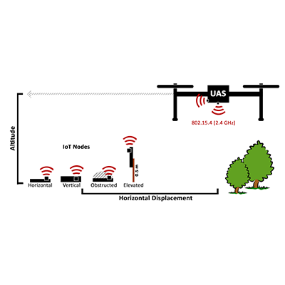

Unmanned Aircraft Systems (UAS), i.e. drones, have been commercially successful in both the consumer and industrial sectors in part due to the wide variety of applications they benefit. In environmental monitoring and precision agriculture, UASs can be utilized for data collection from rural IoT sensor networks. 

These networks frequently operate over some variant of the IEEE 802.15.4 standard, taking advantage of the standard's low power usage. Consumer 802.15.4 radios are widely available in compact form factors, making them ideal for application in environmental and agricultural sensor networks. 

Unlike other wireless standards, 802.15.4 is well studied on the ground but has not received rigorous evaluation in three dimensional aerial communication, which introduces new challenges, such as antenna radiation patterns and extreme ranges. 

