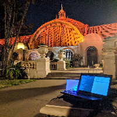

For this project, I am working with [Vivek Adarsh](https://moment.cs.ucsb.edu/people/vivek-adarsh) who is the lead on the project.

Ideally cellular infrastructure (the set of towers and networks that let you talk on your phone and browse reddit) is well provisioned for everyday use (there is enough computing power and bandwidth to accommodate normal load). However this assumptions fails in rural areas where there might not be enough cost incentive (paying customers). Similarly, in a situation of unusual activity such as a large event (parade, sports gathering, etc) the planned capacity might be insufficient for the larger volume of cellular utilization. Likewise, during infrastructure failure, for example as a result from a natural disaster, remaining cellular towers would have to redistribute a load beyond their capacity.

When load exceeded capacity, the local cellular network is called congested. As a response the local tower will take measure to service those as best as it can (steps that can include barring lower priority clients, and/or rejecting new connections). While the cellular providers can internally detect when this type of behavior occurs, those outside the network have to take steps to infer congestion. 

For example suppose you were working for the FCC and wanted to independently verify that people in a rural region were adequately served by the local telecoms. Could you get that information from observing cellular traffic?

Turns out yes you can. In our project we are using a a [Ettus Research USRP](https://www.ettus.com/product) in order to passively listen in on cellular broadcasts. We do this during a time of high activity and compare it to a baseline of usual activity. In the broadcasts we can't see most of the messages as they are encrypted and directed to specific mobile devices. Instead we look at all the unencrypted information sent by the towers themselves. This includes messages that accept and reject cellular connections. We use this type of information to estimate the level of congestion on the network.
