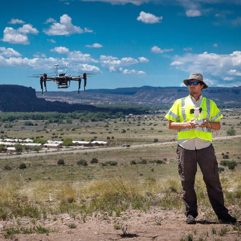

We are devising a new system for automated network assessment from an aerial vehicle. The goal of this project is twofold (1) we want to verify reported coverage areas for various wireless protocols including LTE, TVWS, and WiFi and (2) we want to be able to be able to rapidly plan new network deployments by utilizing open wireless spectrum. In the rural context a new deployment may consist of a permanent wireless backhaul linking remote communities. While during or after a disaster it may take the form of short term deployments utilizing now vacant spectrum.

In order to determine the signal strength of particular frequencies we use hardware called [software defined radios](https://en.wikipedia.org/wiki/Software-defined_radio). In this case we used three separate devices simultaneously an Agilent Spectrum Analyzer, a [Ettus Research USRP](https://www.ettus.com/product), and a RTL-SDR. We followed up on [work by Ahmed Saeed et. al](https://www.cc.gatech.edu/~amsmti3/files/waldo_icdcs17.pdf) that looked at the efficacy of using a lower cost RTL-SDR for spectrum sensing as opposed to the expensive and bulky spectrum analyzer. As we would like to mount our system on a multi-copter, we would like to use the cheapest lightest device, so we performed our own three device comparison in the context of a rural native american reservation.
